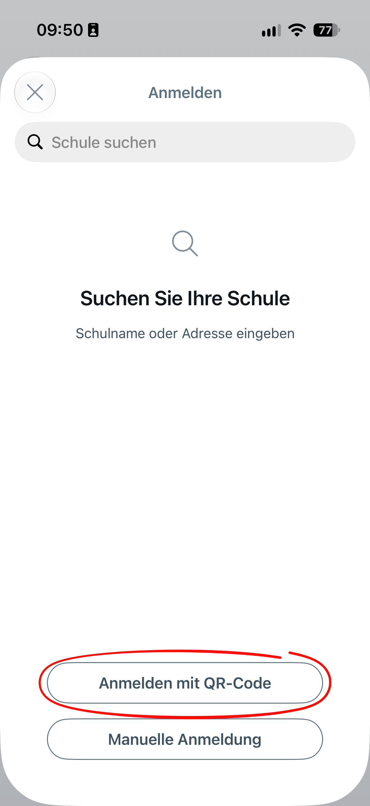
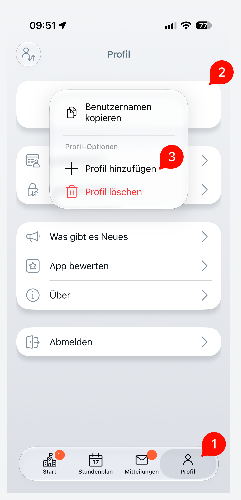

# Anleitung Untis Mobile Login

Für den Untis Mobile Login müssen Sie einen QR-Code auf der Website generieren. Dieser kann dann in der App für die Anmeldung verwendet werden.

1. Melden Sie sich in Ihrem Webbrowser in [Untis](https://webuntis.com) an. (siehe [Schüler Login](students-login.md) bzw. [Eltern Login](parents-login.md))
2. Klicken Sie auf den Benutzernamen (unten links).
3. Wählen Sie "Freigaben" am oberen Bildschirmrand aus.
4. Lassen Sie sich den QR-Code anzeigen.
5. Installieren Sie die Untis Mobile App ([iOS](https://apps.apple.com/de/app/untis-mobile/id926186904) oder [Android](https://play.google.com/store/apps/details?id=com.grupet.web.app&hl=de)).
6. Wählen Sie in der App die Option "QR-Code scannen" und scannen Sie den angezeigten QR-Code auf der Website.

Theoretisch ist es möglich, mehrere Profile in der Untis Mobile App zu verwalten. Dazu müssen Sie sich mit verschiedenen QR-Codes anmelden. Wie sie ein weiteres Profil hinzufügen, ist unten zu sehen. Zum Verwalten von Accounts mehrerer eigener Kinder eignet sich jedoch ein Account für Erziehungsberechtige am besten. Ein Anleitung dafür finden Sie [hier](parents-regis.md).

