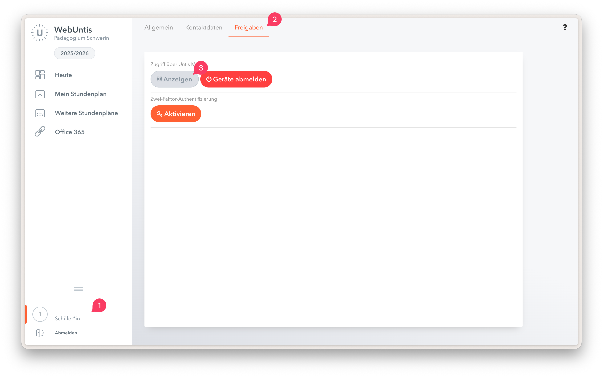

# Anleitung Untis Mobile Login

Für den Untis Mobile Login muss ein QR-Code auf der Website generiert werden. Dieser kann dann in der App für die Anmeldung verwendet werden.

1. Auf den Benutzernamen (unten links) klicken.
2. Am oberen Bildschirmrand "Freigaben" auswählen.
3. QR-Code anzeigen lassen.
4. Untis Mobile App installieren ([iOS](https://apps.apple.com/de/app/untis-mobile/id926186904) oder [Android](https://play.google.com/store/apps/details?id=com.grupet.web.app&hl=de)).
5. "Anmeldung mit QR-Code" auswählen und QR-Code scannen.

