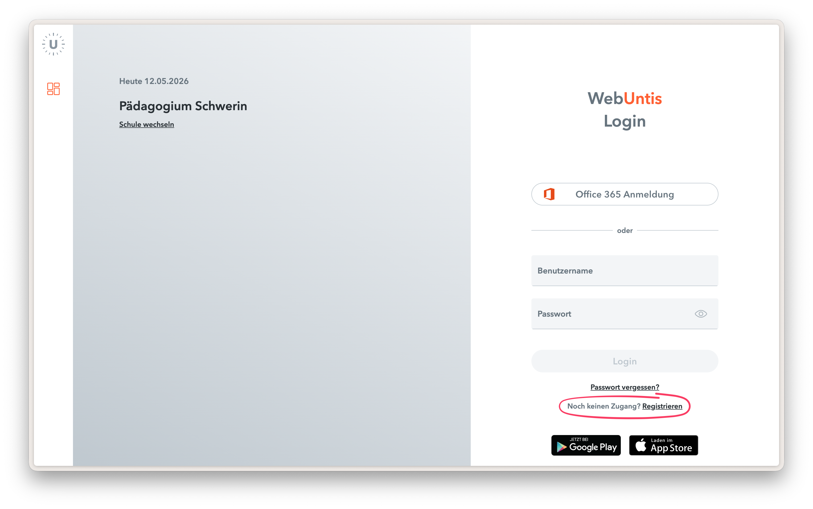

# Anleitung Eltern Login in WebUntis

Auf unserer [WebUntis-Startseite](paedagogium-schwerin.webuntis.com) steht ab sofort die Selbstregistrierung für Erziehungsberechtigte zur Verfügung.

Sofern die E-Mail-Adresse im System gefunden wird, kann ein Account angelegt werden. Die Schüleraccounts werden anschließend automatisch zugeordnet. **Damit die Anmeldung funktioniert, muss die gleiche E-Mail-Adresse verwendet werden, die im Schulvertrag hinterlegt wurde.**

1. [WebUntis-Startseite](paedagogium-schwerin.webuntis.com) aufrufen.
2. Registrierung auswählen.
3. E-Mail Adresse des Erziehungsberechtigten eingeben. Sie muss identisch mit der E-Mail Adresse aus dem Schulvertrag sein.
4. Bestätigungscode per Mail erhalten und auf der Webseite eingeben.
5. Passwort vergeben.
6. Der Account kann auch für die „Untis Mobile“ App verwendet werden. Eine Anleitung dafür finden Sie [hier](webuntis/app-login.md).

Seitens der Schule können keine Eltern-Accounts angelegt werden, die Erstellung funktioniert ausschließlich über die Selbstregistrierung.
Bei Problemen oder Fragen bitte mit der privaten Mail-Adresse und dem Namen der Kinder an den [Helpdesk](index.md/#keine-anhwort-gefunden) wenden.
