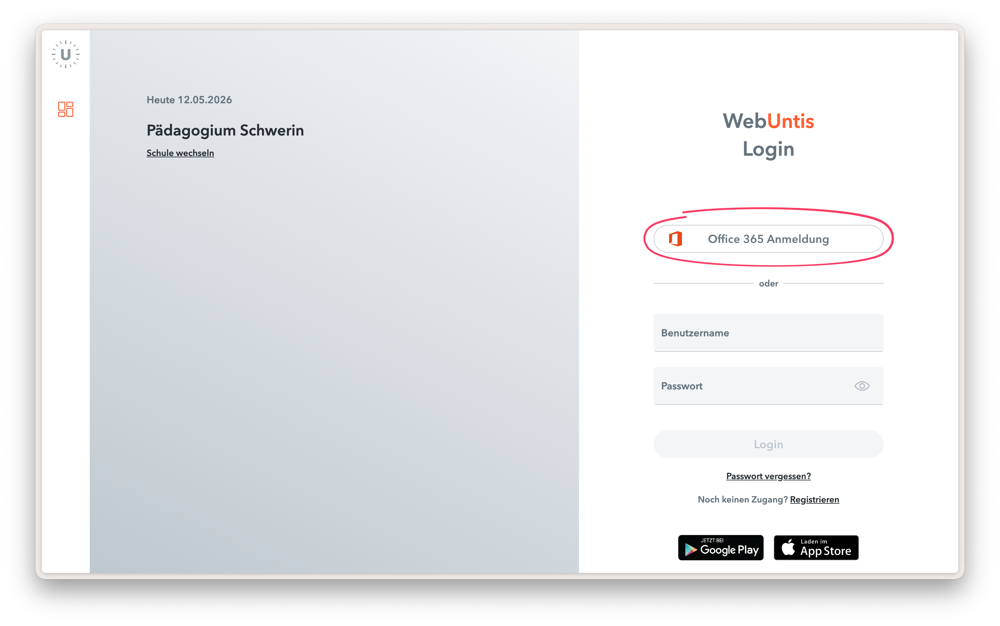

# Anleitung Schüler Login in WebUntis

Die erstmalige Anmeldung muss immer über einen Webbrowser erfolgen. Eine direkte Anmeldung in der App ist nicht möglich. Besuchen Sie für die Anmeldung im Webbrowser die [Startseite](https://paedagogium-schwerin.webuntis.com).

Die Authentifizierung erfolgt über den Office‑Login der Schüler und Schülerinnen. Nach dem Klick auf den entsprechenden Button öffnet sich ein Pop‑up von Microsoft, in dem die Anmeldung erfolgen kann.

1. [WebUntis-Startseite](https://paedagogium-schwerin.webuntis.com) aufrufen.
2. "Office 365 Login" auswählen.
3. Im Pop‑up mit Office‑Schülerzugang anmelden.
4. Die Anmeldung in der Untis Mobile App wird empfohlen. Folgen Sie dafür [dieser Anleitung](app-login.md).

Bei Problemen kann der [Helpdesk](../index.md#keine-antwort-gefunden) weiterhelfen.